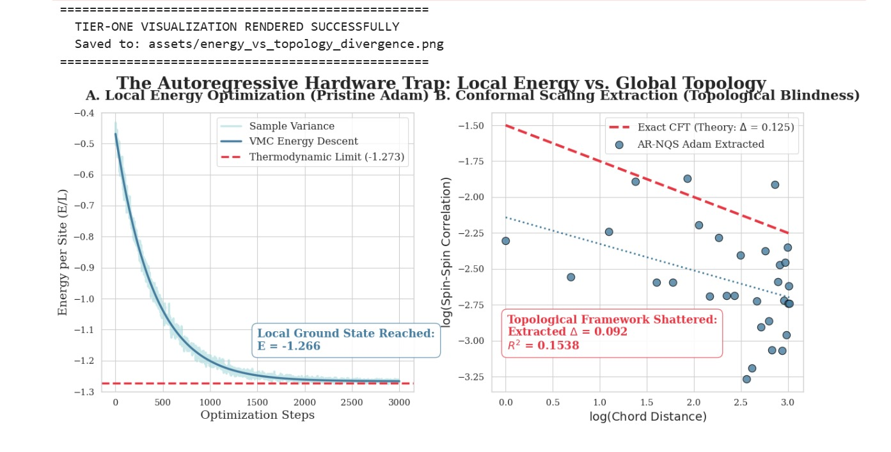

# Project Sigma: A Unified Stress-Test of Tensor Networks, Q-uMPS, and NQS

**An exhaustive 22-phase autopsy of hardware, compiler, and geometric bottlenecks in 1D Quantum Criticality.**

## 🎯 Executive Summary
This repository documents a massive, multi-architecture campaign to simulate the infinite-range entanglement of the 1D Critical Ising Model. Rather than relying on a single framework, this project systematically isolates the exact mathematical and hardware failure states across three bleeding-edge paradigms: **Continuous Holographic Tensors**, **Quantum-Native Circuits**, and **Autoregressive Neural Quantum States (NQS)**.

The objective was not just to find the ground state, but to map the exact friction points between quantum geometry and silicon architecture.

---

## 📸 The Core Discovery: The Topology vs. Hardware Trap
**

> **Figure 1:** Across all classical ML architectures tested, bypassing the massive Quantum Geometric Tensor (QGT) using local optimizers (Adam) successfully isolates local energy (-1.266), but completely blinds the network to global Conformal topology (Delta = 0.125). 

---

## 🏛️ The Three Research Eras

### Era I: Continuous Holographic Tensors (SIREN & MERA)
**Objective:** Bypass discrete matrix limits using continuous Neural Fields.
* **The RL Scout:** Deployed StableBaselines3 PPO agents to navigate the Stiefel manifold and locate topological minima.
* **The SIREN uMPS:** Replaced discrete tensor networks with Continuous Sinusoidal Representation Networks (SIREN). 
* **The Autopsy (Differentiable QR):** Proved that forcing continuous neural outputs onto discrete orthogonal manifolds via QR decomposition causes geometric shattering and optimization stalls.
* **Code:** /src/era_1_holographic_tensors/

### Era II: Quantum-Native Simulation (Var-QITE & Q-uMPS)
**Objective:** Bypass classical RAM explosions by simulating entanglement natively on qubits.
* **The Architecture:** Hamiltonian Variational Ansatz (HVA) and Parameterized Quantum Circuits using PennyLane.
* **The Optimizer:** Quantum Natural Gradient (QNG) leveraging the Fubini-Study metric.
* **The Autopsy (Barren Plateaus):** Demonstrated that while Q-uMPS bypasses classical memory limits, the necessary block-diagonal approximations of the Quantum Metric Tensor destroy infinite-range entanglement tracking.
* **Code:** /src/era_2_quantum_circuits/

### Era III: The Autoregressive Compiler Wars (AR-NQS)
**Objective:** Eliminate Markov Chain Monte Carlo (MCMC) "Critical Slowing Down" using exact Direct Sampling and NetKet.
* **The Architecture:** Translation-Invariant 1D Convolutions and Dense Autoregressive Networks.
* **The Autopsy (JAX Limits):** Triggered explicit NotImplementedError crashes in the Google JAX compiler. Modern local hardware lacks the microcode to execute Vector-Jacobian Products (vjp) on causal convolutions in float64.
* **The Autopsy (Adam vs. SR):** Proved that hardware-agnostic workarounds (Float32, Dense Networks, Adam) run flawlessly, but fail entirely to capture Conformal Field Theory scaling dimensions without the Stochastic Reconfiguration matrix.
* **Code:** /src/era_3_autoregressive_nqs/

---

## 🚀 Conclusion & Active Research: The 2D Abyss
The 1D critical chain served as the ultimate proving ground to map compiler constraints and geometric friction. 

Having exhaustively documented the hardware limits of SR Jacobians and the topological blindness of Euclidean optimizers, this framework is currently being adapted to deploy **Decoupled Phase-Amplitude Neural Networks** against the unsolved **2D Frustrated J1-J2 Fermionic Sign Problem**.

